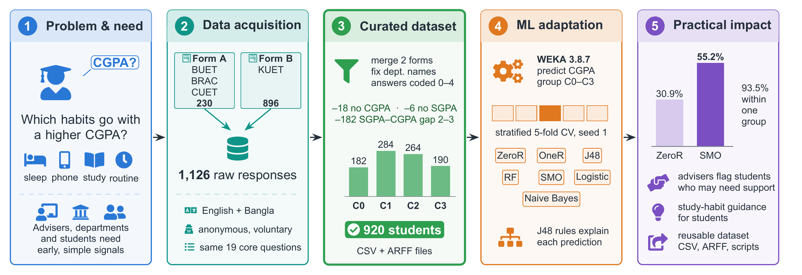
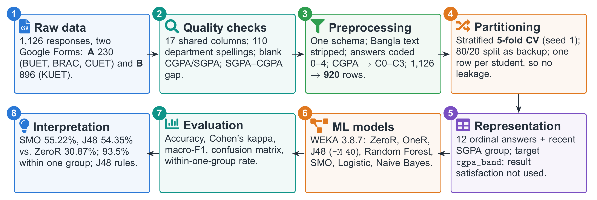

# What Shapes Student CGPA?

A bilingual (English + Bangla) survey dataset of study habits, well-being and CGPA groups for
**920 engineering students** at four universities in Bangladesh (KUET, BUET, BRAC University, CUET).
It comes with a WEKA-ready file and the scripts that rebuild every file from the raw survey exports.

Built for **CSE 4112: Machine Learning Laboratory**, Department of Computer Science and Engineering,
Khulna University of Engineering & Technology.

| | |
|---|---|
| Version | v1.0 (15 September 2026) |
| Rows | 920 students (KUET 690, BUET 104, BRAC 101, CUET 25) |
| Columns | 12 coded answers + recent SGPA group + CGPA group (class) |
| Task | 4-class ordinal classification: CGPA group C0–C3 |
| Formats | CSV and WEKA ARFF |
| License | CC BY 4.0 (proposed) |

---

## Framework



## Technical pipeline



---

## Quick start: open it in WEKA

1. Open WEKA 3.8.x, then **Explorer**, then **Preprocess**, then **Open file…**.
2. Load [`cleaned-dataset/ours/final/final_920.arff`](cleaned-dataset/ours/final/final_920.arff).
   WEKA should show **920 instances** and **14 attributes**.
3. Go to **Classify**, choose **Cross-validation** with **5 folds**, and set the seed to **1** under
   **More options…**.
4. Set the class to **(Nom) cgpa_band**, pick a classifier (for example `functions → SMO`) and click **Start**.

Use the ARFF rather than the CSV. With the CSV, WEKA guesses the order of the groups, which can
reorder the confusion matrix. The full walkthrough, with the expected number for every run, is in
[`docs/FINAL_WEKA_STEPS.md`](docs/FINAL_WEKA_STEPS.md).

---

## The data

### Where it comes from

Two anonymous, voluntary Google Forms asked the same 19 core questions:

| Form | Universities | Raw responses |
|---|---|---|
| A: University Student Performance Analysis Form | BUET, BRAC, CUET | 230 |
| B: Student Performance Analysis Form | KUET | 896 |

The raw exports are in [`raw-data/`](raw-data/) and are never edited. Every other file is rebuilt
from them by script.

### From 1,126 raw responses to 920 rows

| Step | Rows left | Removed |
|---|---:|---:|
| Raw responses from both forms | 1,126 | – |
| No usable CGPA answer (blank or "I don't know") | 1,108 | 18 |
| No real recent-SGPA answer | 1,102 | 6 |
| Recent SGPA group and CGPA group 2–3 steps apart (data check) | **920** | 182 |

The 182 removed answers are listed in `dropped_182_rows.csv` so the check can be audited and undone.

Other cleaning steps:
- Both forms were mapped onto one schema by hand.
- The Bangla part of every answer was stripped, so the same option from the two forms becomes one category.
- 110 department spellings were fixed.
- Both grade formats were turned into four CGPA groups.

### Columns

| Column | Values |
|---|---|
| `desired_department_match`, `attendance`, `weekly_study_time`, `study_style`, `topic_clarity`, `sleep_duration`, `stress_frequency`, `weekly_responsibilities`, `distraction_frequency`, `study_environment`, `support_level`, `routine_manageability` | ordinal codes 0–4 (0 = lowest option); meanings in `answer_codes.csv` |
| `recent_sgpa_band` | C0–C3, same cut-points as the class |
| `cgpa_band` (class) | **C0** below 3.20 (182) · **C1** 3.20–3.49 (284) · **C2** 3.50–3.74 (264) · **C3** 3.75 and above (190) |

Both forms collected grades as ranges, not exact numbers, so this is ordinal classification, not
regression. The result-satisfaction question is left out of the model inputs because it depends
on each student's own expectations.

### Files

All in [`cleaned-dataset/ours/final/`](cleaned-dataset/ours/final/):

| File | Contents |
|---|---|
| `final_920.arff` | The dataset for WEKA |
| `final_920.csv` | The same 920 rows as CSV |
| `final_920_with_details.csv` | The same rows plus university, department, semester and the answer text |
| `answer_codes.csv` | What each code 0–4 means for every question |
| `dropped_182_rows.csv` | The answers removed by the data check |

---

## Results

WEKA 3.8.7, stratified 5-fold cross-validation, seed 1. Inputs: the 12 answers + the recent SGPA group.

| Model | Accuracy % | Kappa | Macro-F1 | Within 1 group % |
|---|---:|---:|---:|---:|
| ZeroR (baseline) | 30.87 | 0.000 | 0.118 | 79.3 |
| OneR | 55.22 | 0.397 | 0.559 | 93.5 |
| J48 (`-M 40`) | 54.35 | 0.384 | 0.550 | 92.5 |
| Random Forest | 54.24 | 0.383 | 0.548 | 90.5 |
| **SMO** | **55.22** | **0.397** | **0.559** | **93.5** |
| Logistic | 54.67 | 0.388 | 0.553 | 92.8 |
| Naive Bayes | 54.46 | 0.386 | 0.552 | 92.6 |

With the 12 answers alone (no recent SGPA), every model stays near the baseline (27.8–33.8%).
The habits in this questionnaire relate to CGPA only weakly, which is itself a finding.

The data is observational and self-reported: the answers are **associated with** CGPA groups,
and nothing here shows that a habit causes a higher CGPA.

Every number above comes from a WEKA log in [`docs/weka_runs/final/`](docs/weka_runs/final/).
Machine-readable copies are in [`docs/final_results.json`](docs/final_results.json).

---

## Rebuild everything

Requires Python 3.14 (pandas, NumPy, SciPy, matplotlib, scikit-learn) and WEKA 3.8.7 installed at
`C:/Program Files/Weka-3-8-7`.

```powershell
python -m venv venv
.\venv\Scripts\Activate.ps1
pip install pandas numpy scipy matplotlib seaborn scikit-learn jupyter

# 1. merge and clean both forms (writes cleaned-dataset/ours/merged/)
python -m jupyter nbconvert --to notebook --execute --inplace notebooks\02_merged_cleaning_eda_modeling.ipynb

# 2. build final_920 and run every WEKA model (writes cleaned-dataset/ours/final/ and docs/weka_runs/final/)
python notebooks\final_weka_results.py

# 3. report tables and figures, then the PDF
cd report
python build_report_assets.py
latexmk -xelatex CSE_4112_Dataset_Report.tex
```

The framework and pipeline figures are TikZ sources in
[`report/figures/src/`](report/figures/src/). The report reads them directly. To refresh the PNGs,
compile `framework_standalone.tex` and `pipeline_standalone.tex` with XeLaTeX and convert the PDFs
(for example `pdftoppm -r 400 -png -singlefile`).

---

## Repository layout

```
raw-data/                  the two Google Forms exports (read-only)
cleaned-dataset/ours/
  merged/                  1,108 cleaned rows, both forms merged
  final/                   the released 920-row dataset
notebooks/                 cleaning, EDA and WEKA scripts
docs/                      guides, result files, WEKA logs, figures
report/                    dataset report (LaTeX + PDF)
presentation/              slide deck
```

---

## Limitations

- **Self-reported.** Every answer, including grades, is self-reported and was not checked against registrar records.
- **Convenience sample.** The sample is KUET-heavy (75%, mostly semester 7), so results may not describe other universities or years. CUET has only 25 rows.
- **Grade ranges.** Grades are ranges, so small differences inside a group are lost. On the CGPA question, Form A asked about the CGPA "before that semester" and Form B about the "current" CGPA.
- **Imperfect data check.** Some kept answers may still be careless, and some removed ones may have been honest.
- **Missing context.** Gender, family income and school background were not collected.

The full discussion is in the [dataset report](report/CSE_4112_Dataset_Report.pdf), Section 12.

---

## Ethics

The survey was anonymous and voluntary, with no incentive. It collected no names, roll numbers or
phone numbers. The KUET export has an e-mail column, but it is empty and is dropped from every
processed file.
Please use the data for teaching and research only, and do not try to identify any respondent.

## Team

| Roll | Name |
|---|---|
| 2107020 | Sheikh Md. Galib Mahim |
| 2107030 | Md. Eftakar Jaman Arfan |
| 2107007 | Asif Jawad |
| 2107008 | Rakibul Islam |
| 2107012 | Md Enam E Elahi |
| 2107014 | Al Mubtasim Preom |

## Citation

> Mahim, S. M. G., Arfan, M. E. J., Jawad, A., Islam, R., Elahi, M. E. E., & Preom, A. M. (2026).
> *What Shapes Student CGPA? A Bilingual Survey Dataset of Study Habits, Well-being and CGPA Groups of
> 920 Engineering Students in Bangladesh* (v1.0). CSE 4112, KUET.
> https://github.com/SheikhGalib/CGPA-does-matter-dataset-ml-lab
