# Why Predictions Land Two or Three CGPA Bands Away — Anomaly Investigation Report

**CSE-4112 Machine Learning Laboratory** · follows [`MERGED_DATASET_REPORT.md`](MERGED_DATASET_REPORT.md)
Team: 2107020 Sheikh Md. Galib Mahim · 2107030 Md. Eftakar Jaman Arfan · 2107007 Asif Jawad ·
2107008 Rakibul Islam · 2107012 Md Enam E Elahi

| | |
|---|---|
| **Notebook** | [`notebooks/03_anomaly_investigation_weka.ipynb`](../notebooks/03_anomaly_investigation_weka.ipynb) (source: `pipeline_v3_source.py`) |
| **Every model number** | produced by **WEKA 3.8.7**; raw output in [`docs/weka_runs/`](weka_runs/) (exact command on line 2 of each file) |
| **Machine-readable results** | [`docs/anomaly_results.json`](anomaly_results.json), tables in [`docs/anomaly_tables/`](anomaly_tables/) |
| **Figures** | [`docs/figures/anomaly/`](figures/anomaly/) (a01–a15) |
| **ARFF files for the Explorer** | [`cleaned-dataset/ours/anomaly/`](../cleaned-dataset/ours/anomaly/) |

---

## 0. Summary for the teacher

**The anomaly.** In our WEKA confusion matrices about **one prediction in five lands two or more
CGPA bands from the truth** — e.g. a C0 student predicted as C3.

**The cause.** Those far errors are not spread across the data. **69% of them fall on the 22% of
students whose *own* recent SGPA and CGPA are two or more bands apart.** Such contradictions are
concentrated in **455 KUET semester-7 responses submitted on 6–7 August 2026**. In that wave, SGPA
and CGPA are essentially unrelated (ρ = −0.04), whereas the same KUET cohort answering before 6
August is consistent (ρ = +0.77). Independent checks that never look at the CGPA — result
satisfaction contradicting the student's own SGPA, unusual answer patterns — are also elevated in
the wave. The wave behaves like careless, random form-filling.

**The fix, verified in WEKA (10-fold CV).**

| | All 1,102 rows | Wave excluded (647 trusted rows) |
|---|---|---|
| ZeroR (floor) | 29.0% | 31.4% |
| **SMO accuracy** | **46.1%** | **61.1%** |
| Cohen's κ | 0.279 | 0.476 |
| Quadratic weighted κ (ordinal agreement) | 0.322 | 0.616 |
| **Far errors (≥ 2 bands)** | **22.0%** | **9.3%** |

The improvement survives three guards against self-deception: removing 455 *random* rows gives no
gain (46.0%); a model trained on trusted rows scores *below ZeroR* on the wave (24.8% vs 25.7%); and
deleting the contradictory rows directly (the circular shortcut) does worse (59.1%).

**What we must say honestly.** On trusted data, OneR — one rule on recent SGPA — scores **exactly**
the same 61.1% as SMO, J48 and Logistic. The accuracy is the rule *CGPA band = recent SGPA band*
becoming reliable; the twelve behaviour answers add no predictive accuracy. They *do* become
statistically clearer: 8 of 12 behaviour associations survive multiple-comparison correction on
trusted data, against 3 of 12 on all rows and 0 of 12 inside the wave.

**The teacher's seven checks, answered.**

| # | Check | Answer |
|---|---|---|
| 1 | Presentation audit | Anomaly reproduced; five inconsistencies in the deck explained (§3) |
| 2 | 5-fold CV / train-test split | No effect on what the model learns; a single split swings ±7 points (§6) |
| 3 | Feature weights | Changes distance/margin models only; trees are immune by construction (§7) |
| 4 | Random filling? Too many prodigies? | Yes — one wave of ~455 responses; "inconsistent prodigies" concentrate there (§4) |
| 5 | KUET only / 4th semester only | KUET 4th semester: 80.3%; KUET semester 7 wave: at ZeroR (§5) |
| 6 | Do the trees mean anything? | Main CGPA tree: yes, stable. Behaviour-only trees: noise / marginal (§8) |
| 7 | Fixes, justified and verified | Exclude the wave (+15 pts); cost-sensitive learning for far errors (§9–§10) |

---

## 1. What was asked and how we answered it

The teacher's observation: errors in the *neighbouring* band are reasonable for ordered classes, but
a significant number of predictions **two or three bands away** is strange and needs an explanation.

**Method.** Every classifier was run in **WEKA 3.8.7**, driven from Python by
[`notebooks/weka_runner.py`](../notebooks/weka_runner.py): Python writes the ARFF, calls WEKA's own
command-line classifier, saves WEKA's complete output to `docs/weka_runs/<name>.txt`, and parses the
confusion matrix out of it. About 1,300 WEKA runs back this report; any number can be re-checked by
opening its log. Python computes only data-quality flags and two extra metrics derived *from WEKA's
confusion matrix*:

- **Far-error rate** — share of predictions with |actual − predicted| ≥ 2 bands. The quantity the
  teacher asked about.
- **Quadratic weighted kappa (QWK)** — agreement for ordered classes. A C0→C3 miss costs 9× a
  one-band miss. Plain accuracy and plain κ treat both errors the same.

**Data.** The team's WEKA setting exactly: **1,102 students** (the 1,108 cleaned rows minus the 6
whose recent SGPA had to be imputed), 12 questionnaire items coded 0–4, recent SGPA band as a
**nominal** attribute, class `cgpa_band` ∈ {C0, C1, C2, C3}.

The 12 items: desired department match, attendance, weekly study time, study style, topic clarity,
sleep, stress, outside commitments, phone distraction, study environment, family/friend support,
routine manageability.

---

## 2. Glossary (for a teammate reading this cold)

| Term | Meaning here |
|---|---|
| **Far error** | prediction two or more bands from the truth |
| **Contradictory student / far gap** | a student whose own recent-SGPA band and CGPA band differ by ≥ 2 |
| **The wave** | KUET semester-7 responses submitted on 6 or 7 August 2026 (455 rows) |
| **Trusted data** | the 647 rows outside the wave |
| **ZeroR** | always predicts the most common band — the floor any model must beat |
| **OneR** | WEKA's best single-attribute rule — here always "CGPA band = recent SGPA band" |
| **Permutation test** | shuffle the class labels, re-train, repeat; if the real model is not better than the shuffled ones, it learned nothing |

---

## 3. Check 1 — reproduce the anomaly and audit the deck

### 3.1 The anomaly, reproduced

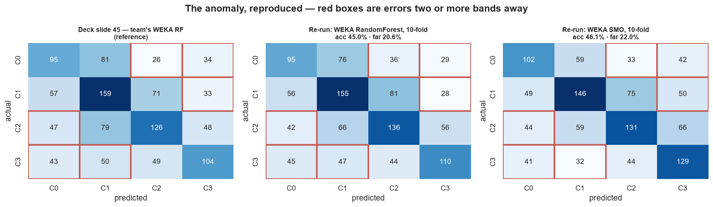

| Run | Accuracy | κ | QWK | Far errors | Log |
|---|---|---|---|---|---|
| Deck slide 45, RandomForest | 43.9% | — | — | 21.1% | (deck) |
| WEKA RandomForest, 10-fold, seed 1 | 45.0% | 0.261 | 0.320 | 20.6% | `A_main_RandomForest_cv10.txt` |
| WEKA SMO, 10-fold, seed 1 | 46.1% | 0.279 | 0.322 | 22.0% | `A_main_SMO_cv10.txt` |
| WEKA ZeroR | 29.0% | 0.000 | 0.000 | 22.3% | `A_main_ZeroR_cv10.txt` |

Random Forest is internally randomised, so its exact count moves by a point or two between runs.
The pattern — about 21% far errors — is identical.

### 3.2 Five inconsistencies in the current deck, each explained

| # | Deck says | What is actually going on | Evidence |
|---|---|---|---|
| 1 | RF main CGPA **43.92%** (slides 36, 48) and **46.3%** (slides 54, 63) | Two separate runs of a randomised model shown as if they were one result | §6 spread table |
| 2 | Slide 36: SMO 37.11%, Logistic 36.84%, NB 38.11% · Slide 63: SMO 46.5%, Logistic 45.1% | **Slide 36 used recent SGPA as a numeric code; slide 63 as nominal.** WEKA reproduces slide 36 to within 0.05 points with numeric SGPA (37.1 / 36.8 / 38.1) | §7.2, `D_encoding_*` logs |
| 3 | J48 CV **38–40%** but J48 trees with 7–15 leaves | The CV runs used WEKA's default `-M 2` (242–272 leaves, 38.0%); the displayed trees used `-M 40` (43.3%) | §8.2 |
| 4 | J48 main CGPA **49.77%** on the test set | Real, and reproduced **cell for cell** by our stratified seed-42 split (matrix on slide 44). It is higher than all 30 random J48 splits we ran (max 48.6%): a lucky split for a model whose CV accuracy is 43.3% | `H_all_J48_supplied_test.txt`, §6 |
| 5 | Tree screenshot with root `routine_manageability` | It is the **behaviour → SGPA** tree trained on one 881-row split; that root appears in only 6 of 30 resamples | §8 |

---

## 4. Check 4 — was some of the form filled randomly? (the cause)

### 4.1 Far errors live on students who contradict themselves

We asked WEKA for per-student cross-validation predictions (row-ID attribute removed inside
`FilteredClassifier`, printed back with each prediction) and split them by whether the student's own
SGPA and CGPA agree.

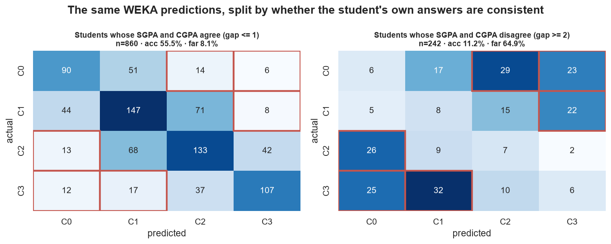

| Students | n | RF accuracy | Far errors |
|---|---|---|---|
| SGPA and CGPA within 1 band | 860 | **55.5%** | 8.1% |
| SGPA and CGPA ≥ 2 bands apart | 242 (22.0%) | **11.2%** | 64.9% |

**69.2% of all 227 far errors** come from the second group. The mechanism: recent SGPA is by far the
strongest input, so the model learns "CGPA ≈ SGPA". A student reporting SGPA C3 and CGPA C0 is
predicted near C3 — three bands off — *because the model is doing the sensible thing with an answer
that contradicts itself*.

### 4.2 Which students contradict themselves?

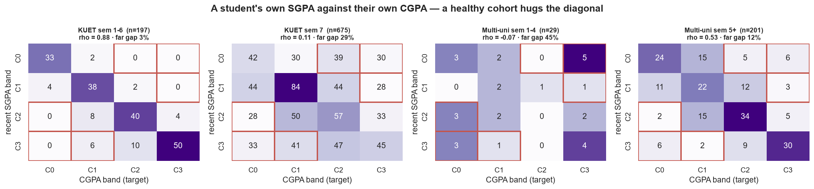

| Cohort | n | SGPA–CGPA Spearman ρ | Far-gap rate | Far-gap rate if SGPA and CGPA were picked at random |
|---|---|---|---|---|
| KUET semesters 1–6 | 197 | **0.88** | **3.0%** | 36.1% |
| KUET semester 7 | 675 | **0.11** | **29.5%** | 34.2% |
| Multi-university semesters 1–4 | 29 | −0.07 | 44.8% | 43.9% |
| Multi-university semesters 5+ | 201 | 0.53 | 11.9% | 35.3% |

KUET semester 7 is close to the random-answer rate. That is the opposite of what arithmetic
predicts: by semester 7 the CGPA averages six or seven semesters, so one SGPA should move it *less*.
A genuine seventh-semester student with a last SGPA below 3.20 and a CGPA of 3.75+ needs roughly a
3.84 average in every earlier semester — possible for one student, not for one in ten.

The multi-university sample is not clean either: BRAC and CUET have **no** far gaps, but **BUET's 75
semester-5+ students show about 32%**, and the 29 early-semester multi-university students are near
the random rate. We did not exclude them — there is no timing evidence and the numbers are small —
but it is listed as an open issue (§13).

### 4.3 When did the contradictions arrive?

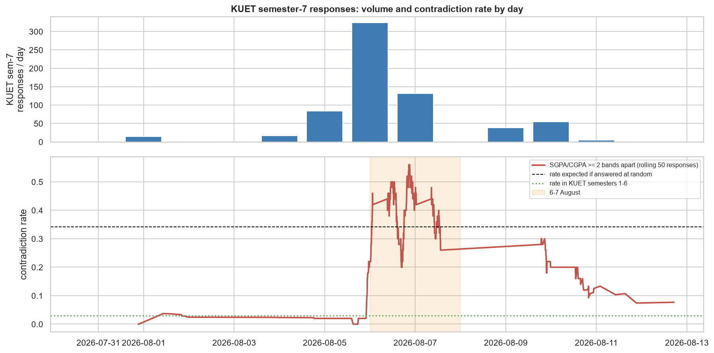

| KUET semester 7 | Responses | Far-gap rate | SGPA–CGPA ρ |
|---|---|---|---|
| 31 Jul – 5 Aug | 120 | **1.7%** | +0.77 |
| **6–7 Aug** | **455** | **40.0%** | **−0.04** |
| 9 Aug onward | 100 | 15.0% | +0.34 |

Day by day: 324 responses on 6 August (40.4% contradictory), 131 on 7 August (38.9%), then 23% and
11%. The contradictions arrived in a **burst**, which points to one distribution channel (for
example a large group chat where the link was forwarded) rather than to a general property of the
survey. The form is anonymous, so we cannot and do not identify who filled it.

### 4.4 Independent evidence that never uses the CGPA

If the wave is careless, it should also look careless on answers unrelated to the target.

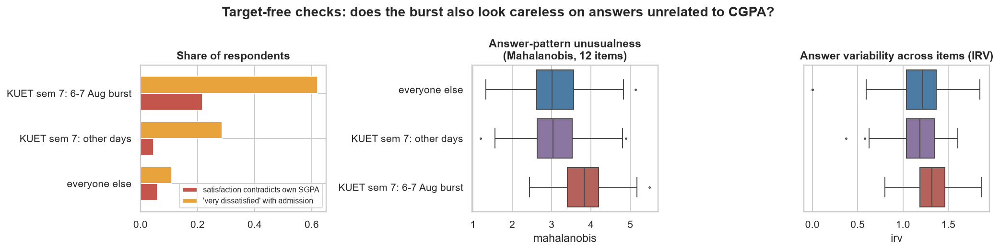

| Indicator | Wave | Everyone else | Test | p |
|---|---|---|---|---|
| Result satisfaction contradicts own SGPA ("very satisfied" with SGPA < 3.20, or "very dissatisfied" with ≥ 3.75) | **21.8%** | 5.4% | χ² | < 0.0001 |
| "Very dissatisfied" with admission | **62.0%** | 17.0% | χ² | < 0.0001 |
| Mahalanobis distance across the 12 items | **3.82** | 3.08 | Mann–Whitney | < 0.0001 |
| Answer variability (IRV) | 1.32 | 1.19 | Mann–Whitney | < 0.0001 |
| Longest run of identical answers | 2.29 | 2.50 | Mann–Whitney | 0.0001 |

The first three point to carelessness without touching the CGPA. The last two point the *other*
way: wave respondents vary their answers **more** and repeat the same click **less**. They did not
straight-line down the page; they clicked varied answers that do not fit together — fast, careless
filling, not a bot. The earlier unexplained spike of "very dissatisfied with admission" on the KUET
form (notebook 02, §6.5) is explained by the same wave.

### 4.5 "Too many prodigies at KUET?"

| | n | CGPA C3 share | SGPA C3 but CGPA C0 | SGPA C0 but CGPA C3 |
|---|---|---|---|---|
| Everyone else | 427 | 25.8% | 2.1% | 2.6% |
| KUET sem 7, other days | 220 | 13.6% | 0.5% | 0.5% |
| **KUET sem 7, 6–7 Aug** | 455 | 23.3% | **7.0%** | **6.4%** |

The hunch was partly right. The share of top-band students is not wildly out of line on its own.
What is implausible is the number of **inconsistent prodigies** — top-band SGPA with a bottom-band
CGPA, or the reverse — and those are 10× more common in the wave than in the rest of semester 7.

---

## 5. Check 5 — KUET only, 4th semester only

WEKA 5-fold stratified CV, repeated with seeds 1–5, confusion matrices summed. Each subset is
compared to its own ZeroR.

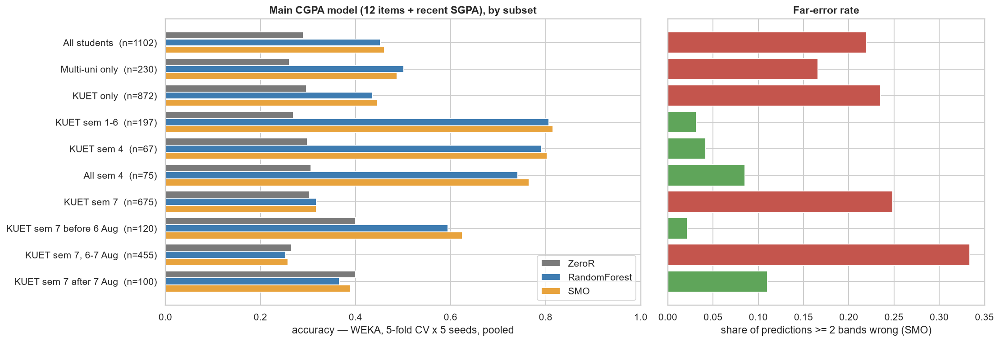

| Subset | n | ZeroR | J48 | RF | **SMO** | SMO far errors |
|---|---|---|---|---|---|---|
| All students | 1,102 | 29.0% | 43.7% | 45.2% | **46.1%** | 22.0% |
| Multi-uni only | 230 | 26.1% | 51.7% | 50.2% | **48.8%** | 16.6% |
| KUET only | 872 | 29.7% | 42.8% | 43.6% | **44.6%** | 23.5% |
| KUET sem 1–6 | 197 | 26.9% | 78.1% | 80.7% | **81.5%** | 3.1% |
| **KUET sem 4** | 67 | 29.9% | 29.9%* | 79.1% | **80.3%** | 4.2% |
| **All sem 4** | 75 | 30.7% | 30.7%* | 74.1% | **76.5%** | 8.5% |
| KUET sem 7 | 675 | 30.4% | 31.0% | 31.7% | **31.7%** | 24.9% |
| KUET sem 7 before 6 Aug | 120 | 40.0% | 36.7% | 59.5% | **62.5%** | 2.2% |
| **KUET sem 7, 6–7 Aug** | 455 | 26.6% | 25.7% | 25.4% | **25.8%** | 33.4% |
| KUET sem 7 after 7 Aug | 100 | 40.0% | 39.0% | 36.6% | **39.0%** | 11.0% |

\* J48 `-M 40` cannot split 67 students into leaves of 40, so the tree is one leaf = ZeroR. A
setting, not a finding.

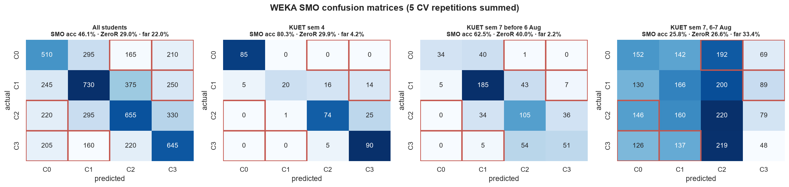

**Answer to the teacher.** The low accuracy is **not** a whole-dataset property and **not** a
KUET-wide property. The KUET 4th semester reaches 80%; KUET semester 7 before 6 August reaches 62.5%;
the 6–7 August wave is at its own ZeroR.

**Caveat that must accompany the 80%.** In early semesters the CGPA averages only a few semesters,
and on the KUET form one of them *is* the recent SGPA — every KUET semester-2 student reports the
same band for both. There the target nearly equals an input by construction, so 80% is not "the
model is excellent". The comparison that isolates data quality is **inside one cohort**: KUET
semester 7 before the wave (62.5%) versus the wave (25.8%), same overlap structure, 37-point gap.

Behaviour-only models (12 items, no SGPA) stay near their floors in every subset; the best is Random
Forest on KUET semesters 1–6 (38.4% vs 26.9%).

---

## 6. Check 2 — 5-fold CV and train/test splits

| Main CGPA model | 10-fold CV | 5-fold CV | 80/20 split | 70/30 split |
|---|---|---|---|---|
| ZeroR | 29.0 | 29.0 | 25.9 | 27.2 |
| J48 (-M 40) | 43.3 | 43.6 | 38.6 | 42.9 |
| NaiveBayes | 44.3 | 44.8 | 45.9 | 47.7 |
| Logistic | 45.7 | 46.4 | 44.5 | 48.6 |
| RandomForest | 45.0 | 45.0 | 50.5 | 47.7 |
| SMO | 46.1 | 46.1 | 44.5 | 48.0 |

(accuracy %, seed 1; split rows are WEKA's random *Percentage split*)

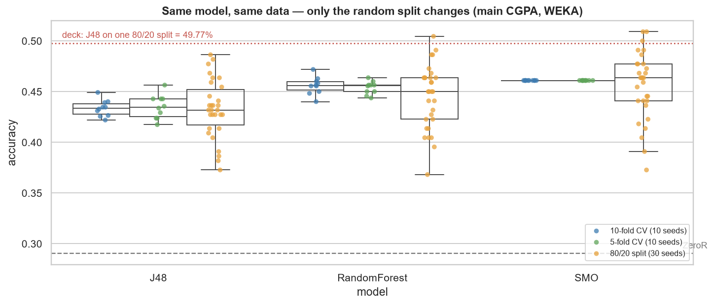

| Model | 10-fold CV, 10 seeds | 5-fold CV, 10 seeds | 80/20 split, 30 seeds |
|---|---|---|---|
| J48 | 43.4 ± 0.8 (42.2–44.9) | 43.5 ± 1.2 | 43.3 ± 2.9 (**37.3–48.6**) |
| RandomForest | 45.6 ± 0.9 | 45.4 ± 0.6 | 44.5 ± 3.2 (**36.8–50.5**) |
| SMO | 46.1 ± 0.0 | 46.1 ± 0.0 | 45.6 ± 3.4 (**37.3–50.9**) |

**Answer.** 5-fold and 10-fold agree within about a point; neither changes what the model can learn,
because nothing about the data changed. A single train/test split is a lottery with a 11–14 point
range. **Report 10-fold CV as the result**; if a split is shown for teaching, say it is one draw.

---

## 7. Check 3 — assigning different weights to features

### 7.1 Weighting recent SGPA

Recent SGPA was multiplied by a weight *w*; the 12 behaviour items stayed at 1. WEKA's automatic
normalisation was switched off for IBk and SMO so the weighting is not silently undone.

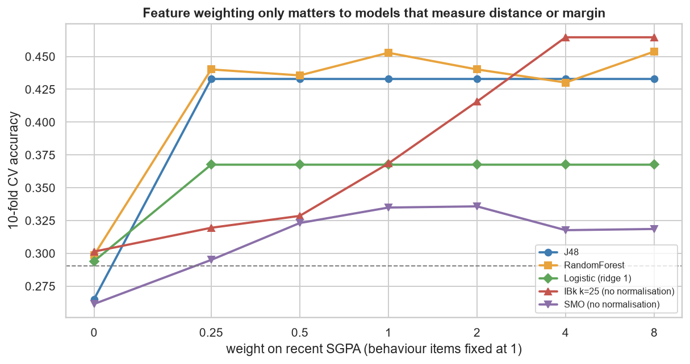

| SGPA weight | J48 | RandomForest | Logistic (ridge 1) | IBk k=25, no normalisation | SMO, no normalisation |
|---|---|---|---|---|---|
| 0 | 26.5 | 29.9 | 29.4 | 30.1 | 26.1 |
| 0.25 | 43.3 | 44.0 | 36.8 | 31.9 | 29.5 |
| 1 | 43.3 | 45.3 | 36.8 | 36.8 | 33.5 |
| 2 | 43.3 | 44.0 | 36.8 | 41.6 | 33.6 |
| 4 | 43.3 | 43.0 | 36.8 | **46.5** | 31.8 |
| 8 | 43.3 | 45.4 | 36.8 | 46.5 | 31.9 |

**Why it changes (or does not):**

- **Trees are immune.** J48 asks "is SGPA ≤ 1?"; multiplying SGPA by 4 moves the threshold to 4 and
  the tree is identical (43.3% at every weight > 0). Random Forest wobbles by its own randomness.
- **Distance models are not.** IBk's distance adds up differences across all 13 features; with
  equal weights, twelve noisy behaviour items drown SGPA. Weighting SGPA up makes a student's
  neighbours the students with a similar SGPA: 30.1% → 46.5%.
- **SMO without normalisation** never recovers normal SMO (46.1%): raw-scale weights distort the
  margin — WEKA's default normalisation is doing useful work.
- **Weight 0 collapses every model** to behaviour-only level — SGPA carries the prediction.

### 7.2 Weight 0 or 1 — attribute selection, and the SGPA encoding

`AttributeSelectedClassifier` (InfoGain ranker, selection inside every CV fold):

| Features kept (top *k*) | J48 | RandomForest | Logistic | SMO |
|---|---|---|---|---|
| 1 (recent SGPA) | **46.1** | **46.1** | **46.1** | **46.1** |
| 13 (all) | 43.3 | 45.0 | 45.7 | 46.1 |

**The single SGPA feature is as good as all 13.**

Recent SGPA as nominal vs numeric:

| Model | nominal | numeric | deck slide 36 | deck slide 63 |
|---|---|---|---|---|
| SMO | 46.1 | **37.1** | **37.11** | 46.5 |
| Logistic | 45.7 | **36.8** | **36.84** | 45.1 |
| NaiveBayes | 44.3 | **38.1** | **38.11** | 39.7 |
| RandomForest | 45.0 | 45.3 | 43.92 | 46.3 |
| J48 | 43.3 | 43.3 | 38.29 | 39.8 |

Nominal gives each SGPA band its own weight ("SGPA = C1 → vote C1"); one numeric slope per class
cannot bend to fit the middle bands. Trees split either encoding the same way. **Use nominal.**

---

## 8. Check 6 — do the three decision trees mean anything?

A tree always prints confident rules, even on noise. Two tests noise cannot pass:

- **Permutation:** shuffle the class 99 times, let J48 learn each shuffled version; compare.
- **Stability:** build J48 on 30 different random 80% samples; count how often each question is the
  first split.

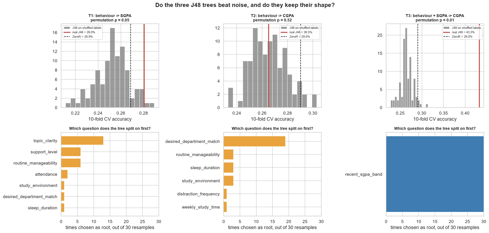

| Tree (J48 -M 40) | CV acc | ZeroR | Shuffled mean | Permutation p | Most common root | Distinct roots | Leaves |
|---|---|---|---|---|---|---|---|
| **T1** behaviour → recent SGPA | 28.0% | 26.9% | 25.3% | 0.05 | topic_clarity (13/30) | 7 | 15 |
| **T2** behaviour → CGPA | 26.5% | 29.0% | 26.5% | 0.52 | desired_department_match (19/30) | 6 | 13 |
| **T3** behaviour + SGPA → CGPA | **43.3%** | 29.0% | 26.5% | **0.01** | **recent_sgpa_band (30/30)** | **1** | 7 |

**Verdict.**

- **T3 is real and stable** — beats every shuffled tree; always splits on recent SGPA first.
- **T2 is noise** — below ZeroR and exactly at the shuffled mean. It usually finds the one weak real
  signal first (desired department), but everything below that split fits noise.
- **T1 is marginal** — 1.1 points above ZeroR, p = 0.05, seven different roots in 30 samples.

**The deck's tree screenshot** (root `routine_manageability`, then `topic_clarity > 3 → C0`, leaves
summing to 881) is **T1** trained on one 80% split. Its root appears in 6 of 30 resamples. Present it
as an illustration of what a tree does with weak signal, not as rules to interpret.

### 8.1 Leaf size explains the 242–315-leaf trees

| J48 minNumObj (-M) | 2 (default) | 5 | 10 | 20 | 40 | 80 |
|---|---|---|---|---|---|---|
| T3 CV accuracy | 38.0% | 41.0% | 44.1% | 43.8% | 43.3% | 45.6% |
| T3 leaves | 242 | 64 | 34 | 13 | 7 | 4 |

The default tree memorises individual students. At `-M 80` the tree is one leaf per SGPA band.

---

## 9. Check 7 — fixes, justified and verified

All runs: WEKA 10-fold stratified CV, seeds 1–3, confusion matrices summed.

| Fix | Cause it targets | Why it should work |
|---|---|---|
| **F1** CostSensitiveClassifier, linear cost \|i−j\| | Model treats a 3-band miss like a 1-band miss | Minimising expected cost steers predictions away from far bands |
| **F2** Remove wave rows from *training folds only* | Model learns wrong rules from random rows | Cleaner training labels |
| **F3** Exclude the 6–7 Aug wave | 455 rows answer SGPA/CGPA at random | Removes unlearnable rows from training *and* evaluation |
| **F4** F3 + target-free quality screen | Careless answers outside the wave | Satisfaction-contradiction + top-5% Mahalanobis outliers, no CGPA used |
| **F5** F3 + cost-sensitive | Remaining far errors | Both effects together |
| Tuning (500 trees) | "Maybe the model is under-powered" | If this helps, the model was the bottleneck |

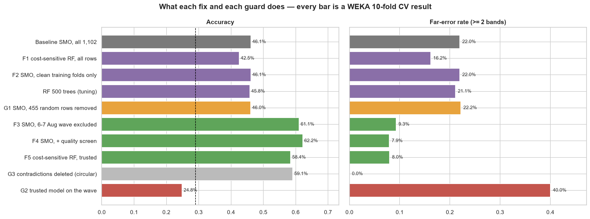

| Data | Model / fix | Rows | Acc | κ | QWK | Far errors | Macro-F1 |
|---|---|---|---|---|---|---|---|
| all | ZeroR | 1,102 | 29.0% | 0.000 | 0.000 | 22.3% | 0.113 |
| all | OneR | 1,102 | 46.1% | 0.279 | 0.322 | 22.0% | 0.460 |
| all | SMO (baseline) | 1,102 | 46.1% | 0.279 | 0.322 | 22.0% | 0.460 |
| all | RandomForest (baseline) | 1,102 | 44.9% | 0.260 | 0.302 | 22.0% | 0.447 |
| all | **F1** cost-sensitive RF | 1,102 | 42.5% | 0.210 | 0.335 | **16.2%** | 0.398 |
| all | **F2** SMO, clean training folds | 1,102 | 46.1% | 0.279 | 0.322 | 22.0% | 0.460 |
| all | RF 500 trees (tuning) | 1,102 | 45.8% | 0.271 | 0.326 | 21.1% | 0.456 |
| trusted | ZeroR | 647 | 31.4% | 0.000 | 0.000 | 21.6% | 0.119 |
| trusted | OneR | 647 | 61.1% | 0.476 | 0.617 | 9.3% | 0.613 |
| trusted | J48 | 647 | 61.1% | 0.476 | 0.617 | 9.3% | 0.613 |
| trusted | NaiveBayes | 647 | 59.2% | 0.451 | 0.578 | 10.8% | 0.594 |
| trusted | Logistic | 647 | 60.7% | 0.471 | 0.617 | 9.3% | 0.610 |
| trusted | **F3** SMO | 647 | **61.1%** | **0.476** | **0.617** | **9.3%** | 0.613 |
| trusted | **F3** RandomForest | 647 | 60.3% | 0.463 | 0.590 | 10.2% | 0.606 |
| trusted | **F5** cost-sensitive RF | 647 | 58.4% | 0.431 | 0.618 | 8.0% | 0.585 |
| trusted + screen | ZeroR | 606 | 33.0% | 0.000 | 0.000 | 20.1% | 0.124 |
| trusted + screen | **F4** SMO | 606 | **62.2%** | **0.488** | **0.643** | **7.9%** | 0.626 |
| trusted + screen | F4 RandomForest | 606 | 60.5% | 0.463 | 0.608 | 9.4% | 0.609 |

### 9.1 Guards — are we fooling ourselves?

| Guard | The worry | Result | Verdict |
|---|---|---|---|
| **G1** remove 455 *random* rows, 10 draws | "It only improved because there are fewer rows" | SMO 46.0%, RF 44.7% | No — it is *which* rows |
| **G2** train on trusted, test on the wave | "Those students are real, just harder" | SMO 24.8%, RF 24.0%, ZeroR 25.7% | Below ZeroR — unlearnable, not hard |
| **G3** delete the contradictory rows themselves | "Excluding the wave is disguised cherry-picking" | SMO 59.1% | Below F3 — it is not the same thing |

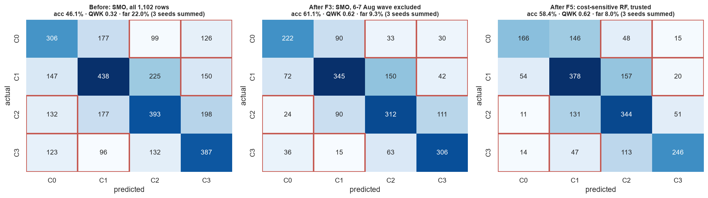

### 9.2 Reading the results

- **F1** reduces far errors (22.0% → 16.2%) but loses accuracy by pulling predictions to the middle
  bands. It treats the symptom.
- **F2 changes nothing** (46.1% → 46.1%). A model trained on clean rows must still be scored on
  random rows — **the noise caps the measurable accuracy**. This is why cleaning only the training
  data is not enough.
- **Tuning does nothing** — the model is not the bottleneck.
- **F3 is the genuine improvement** and survives G1–G3. F4 adds a point; F4/F5 give the fewest far
  errors (~8%).
- **What 61% is.** OneR scores *exactly* what SMO and J48 score, on all rows and on trusted rows.
  The trusted J48 tree has four leaves, one per SGPA band:

  ```
  recent_sgpa_band = C0: C0 (92.0/33.0)
  recent_sgpa_band = C1: C1 (148.0/54.0)
  recent_sgpa_band = C2: C2 (149.0/66.0)
  recent_sgpa_band = C3: C3 (128.0/49.0)
  ```

  Removing the wave did not make behaviour predictive; it made the SGPA–CGPA relationship reliable
  again.

### 9.3 Why excluding data is defensible here — and its limits

- The rule is **stated in advance of modelling and applied to whole rows by cohort and date**, not
  chosen fold-by-fold, and it removes consistent-looking wave rows too (60% of the wave).
- It is supported by evidence that does not use the CGPA (§4.4) and survives G1–G3.
- **Limit:** the window was *found* by looking at SGPA–CGPA agreement, so the trusted result is
  partly selected on the relationship it then measures. G3 shows it is not equivalent to deleting
  contradictions, but a fully independent confirmation needs new data (§13).
- **Always report both columns.** Full-data 46.1% and trusted 61.1% belong side by side.

---

## 10. Recommended final setup and the train/test demonstration

| Decision | Choice | Why |
|---|---|---|
| Rows | Exclude KUET semester-7 responses of 6–7 Aug 2026; **show full data beside it** | §4, §9.1 |
| Features | 12 items (numeric 0–4) + recent SGPA **nominal** | §7.2 |
| Baselines | ZeroR **and OneR** | OneR shows the accuracy is the SGPA rule |
| Headline model | **SMO** | joint best on trusted data, identical across seeds |
| Readable rules | **J48 -M 40** | on trusted data it is the four SGPA rules |
| Fewest far errors | CostSensitiveClassifier (linear) + RandomForest | §9 |
| Evaluation | **10-fold stratified CV** | §6 |
| Metrics | accuracy, κ, **QWK**, far-error rate, confusion matrix | ordinal target; far errors are the teacher's question |

**Fixed 80/20 split for the Explorer** (stratified, seed 42 — the same split as the deck's slide
44):

| Model | All rows: test acc (n=221) | All: far errors | Trusted: test acc (n=130) | Trusted: far errors |
|---|---|---|---|---|
| ZeroR | 29.0% | 22.6% | 31.5% | 21.5% |
| OneR | 49.3% | 20.4% | 61.5% | 10.0% |
| J48 -M 40 | 49.8% | 18.6% | 61.5% | 10.0% |
| NaiveBayes | 49.8% | 20.4% | 60.0% | 10.8% |
| Logistic | 48.9% | 20.4% | 60.8% | 11.5% |
| SMO | 49.3% | 20.4% | 61.5% | 10.0% |
| RandomForest | 47.1% | 19.5% | 62.3% | 10.0% |
| Cost-sensitive RF | 39.4% | 13.6% | 59.2% | 8.5% |

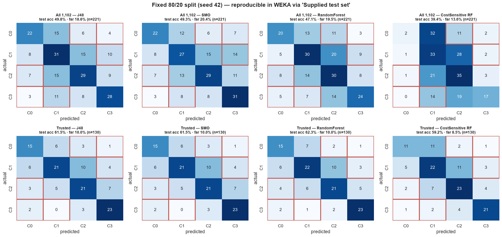

The trusted test set has only 130 students; the CV numbers in §9 are the headline, this split is the
demonstration.

---

## 11. Pipeline A revisited — behaviour findings on trusted data

Excluding the wave was decided from SGPA–CGPA agreement; the behaviour–CGPA associations played no
part, so re-testing them is a fair check. If the wave was noise, removing it should *strengthen*
real associations.

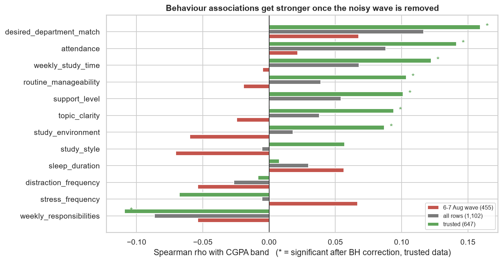

| Question | ρ all | q all | **ρ trusted** | **q trusted** | ρ wave |
|---|---|---|---|---|---|
| desired_department_match | +0.117 | 0.001 | **+0.159** | **0.001** | +0.068 |
| attendance | +0.088 | 0.016 | **+0.141** | **0.002** | +0.021 |
| weekly_study_time | +0.068 | 0.074 | **+0.122** | **0.007** | −0.005 |
| weekly_responsibilities | −0.087 | 0.016 | **−0.109** | **0.016** | −0.054 |
| routine_manageability | +0.039 | 0.356 | **+0.103** | **0.020** | −0.019 |
| support_level | +0.054 | 0.173 | **+0.101** | **0.020** | +0.000 |
| topic_clarity | +0.038 | 0.356 | **+0.094** | **0.029** | −0.025 |
| study_environment | +0.018 | 0.662 | **+0.087** | **0.040** | −0.060 |
| study_style | −0.005 | 0.857 | +0.057 | 0.177 | −0.070 |
| stress_frequency | −0.006 | 0.857 | −0.068 | 0.114 | +0.067 |
| sleep_duration | +0.030 | 0.483 | +0.008 | 0.844 | +0.056 |
| distraction_frequency | −0.027 | 0.505 | −0.009 | 0.844 | −0.054 |

(q = Benjamini–Hochberg corrected p; bold = q < 0.05)

**Significant behaviour associations: 3 of 12 on all rows → 8 of 12 on trusted rows → 0 of 12 in the
wave.** Every association is still small (largest ρ = 0.16) — associated, not determining.
Behaviour-only Random Forest: 37.4% vs a 31.4% floor on trusted data (32.0% vs 29.0% on all rows).

Per-answer CGPA-band mixes for all 12 questions, all rows and trusted, are in
[`anomaly_tables/question_option_cgpa_mix_all_vs_trusted.csv`](anomaly_tables/question_option_cgpa_mix_all_vs_trusted.csv)
and drawn in `a15_question_option_cgpa_mix_trusted.png` — replacement data for deck slides 23–34.

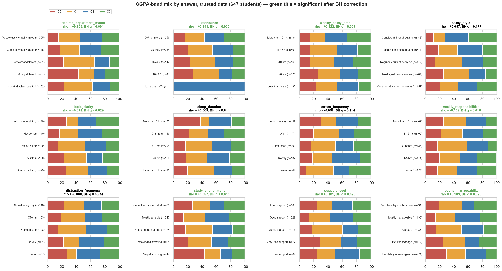

---

## 12. What we can and cannot claim

**Can claim**

- The far-error anomaly is caused mainly by one wave of internally inconsistent responses; evidence
  from timing, SGPA–CGPA agreement and target-free careless-response indicators agrees.
- Excluding that wave raises WEKA SMO from 46.1% to 61.1% (κ 0.279 → 0.476, QWK 0.322 → 0.616) and
  cuts far errors from 22.0% to 9.3%, and the gain survives three guards.
- Prediction accuracy comes from recent SGPA; behaviour answers add no predictive accuracy.
- On trusted data, 8 of 12 behaviour answers are reliably (if weakly) associated with CGPA band.
- The evaluation scheme (5- vs 10-fold) does not matter; single splits are unreliable.

**Cannot claim**

- Who filled the wave or why (the form is anonymous).
- That every wave row is fake (about 60% look consistent), or that every trusted row is genuine
  (BUET's 32% far-gap rate is unexplained).
- Any causal effect of behaviour on CGPA (cross-sectional, self-reported).
- That 80% in early semesters means a strong model (SGPA ≈ CGPA by construction there).

---

## 13. Next steps

1. **Reproduce the headline runs in the WEKA Explorer** (§14) and take the screenshots listed in §15.
2. **Update the deck** following §15.
3. **Tell the teacher explicitly** that rows were excluded, show the rule and both result columns, and
   ask whether the course accepts the exclusion. Present the full-data result as primary if not.
4. **Investigate BUET**: 75 semester-5+ students with 32% far gaps. Check timestamps the same way.
5. **Collect a validation sample**: re-circulate the form to KUET semester 7 through a *different*
   channel; if the new responses are consistent (far gap ≲ 5%), the wave diagnosis is confirmed
   independently.
6. **Fix the form for any future round**: one attention-check item ("select *Often* for this
   question"), exact CGPA as a number, "limit to 1 response", and a repeated SGPA question worded
   differently for a built-in consistency check.
7. **Ordinal models**: WEKA's `ordinalClassClassifier` package could not be installed here (package
   repository returned HTTP 403). Install it on another network and compare with CostSensitive.
8. Optionally re-run notebook 02's Python pipeline on trusted rows so the two notebooks tell one
   story.

---

## 14. WEKA Explorer — reproduce every headline result

All files: `cleaned-dataset/ours/anomaly/`. WEKA 3.8.7 → **Explorer**.

### 14.0 Common steps for every run

1. **Preprocess** → **Open file…** → pick the ARFF. Check *Instances* in the *Current relation* box.
2. **Classify** → **Choose** → the classifier below. Click the classifier's name to edit settings.
3. **Test options**: **Cross-validation, Folds = 10** — or **Supplied test set** → **Set…** →
   **Open file…** → the `_test20.arff` → **Close**.
4. **More options…** → **Random seed for XVal / % Split = 1**.
5. Class drop-down above **Start** must read **(Nom) cgpa_band**. Press **Start**.
6. **Result list** → right-click → **Save result buffer**, named like the log in `docs/weka_runs/`.

**Default settings used** — RandomForest, SMO, Logistic, NaiveBayes, OneR, ZeroR: WEKA defaults.
**J48: set `minNumObj` = 40** (default is 2).

### 14.1 Reproduce the anomaly — `main_cgpa_1102.arff` (1,102 instances), 10-fold CV

| Classifier | Expected accuracy | Log |
|---|---|---|
| rules → ZeroR | 29.0381% | `A_main_ZeroR_cv10.txt` |
| rules → OneR | 46.098% | `F_allrows_OneRsinglebestfeature_s1.txt` |
| functions → SMO | 46.098% | `A_main_SMO_cv10.txt` |
| trees → RandomForest | 45.0091% | `A_main_RandomForest_cv10.txt` |
| trees → J48 (minNumObj 40) | 43.3% | `C_main_J48_10foldCV.txt` |

Expected SMO confusion matrix (rows = actual C0..C3):

```
  a   b   c   d   <-- classified as
 102  59  33  42 |   a = C0
  49 146  75  50 |   b = C1
  44  59 131  66 |   c = C2
  41  32  44 129 |   d = C3
```

Far errors = 33+42+50+44+41+32 = **242 / 1102 = 22.0%**.

### 14.2 The fix — `trusted_main_cgpa.arff` (647 instances), 10-fold CV

| Classifier | Expected accuracy | Log |
|---|---|---|
| ZeroR | 31.38% | `F_trusted_ZeroR_s1.txt` |
| OneR | 61.05% | `F_trusted_OneRsinglebestfeature_s1.txt` |
| J48 (minNumObj 40) | 61.05% | `F_trusted_J48_s1.txt` |
| SMO | 61.05% | `F_trusted_F3SMO_s1.txt` |
| Logistic | ≈ 60.7% | `F_trusted_Logistic_s1.txt` |
| RandomForest | ≈ 60% (moves ±1 with seed) | `F_trusted_F3RandomForest_s1.txt` |

Expected SMO confusion matrix:

```
  a   b   c   d   <-- classified as
  74  30  11  10 |   a = C0
  24 115  50  14 |   b = C1
   8  30 104  37 |   c = C2
  12   5  21 102 |   d = C3
```

Far errors = 11+10+14+8+12+5 = **60 / 647 = 9.3%**.

Optional F4: `trusted_screened_main_cgpa.arff` (606 instances), SMO ≈ 62.2%.

### 14.3 Cost-sensitive learning (fewer far errors)

1. **Choose → meta → CostSensitiveClassifier**, click its name.
2. **classifier** → Choose → trees → RandomForest.
3. **costMatrix** → click → **Classes: 4** → **Resize** → enter:
   ```
   0 1 2 3
   1 0 1 2
   2 1 0 1
   3 2 1 0
   ```
   (row = actual, column = predicted; cost = bands wrong) → close.
4. **minimizeExpectedCost = True** → OK → 10-fold CV → Start.

Expected: all rows ≈ 42–43% with ~16% far errors; trusted ≈ 58% with ~8% far errors.

### 14.4 Train/test split for screenshots (Supplied test set)

| Training file | Test file | J48 (minNumObj 40) | SMO | RandomForest |
|---|---|---|---|---|
| `split_all_train80.arff` (881) | `split_all_test20.arff` (221) | 49.77% | 49.32% | ≈ 47% |
| `split_trusted_train80.arff` (517) | `split_trusted_test20.arff` (130) | 61.54% | 61.54% | ≈ 62% |

`split_all` J48 must give exactly the deck's slide-44 matrix:

```
 22 15  6  4
  8 31 15 10
  7 15 29  9
  3 11  8 28
```

`split_trusted` SMO / J48 expected matrix:

```
 15  6  3  1
  6 21 10  4
  3  5 21  7
  2  0  3 23
```

For the tree picture: J48 on `split_trusted_train80.arff` → right-click the result → **Visualize
tree** → four leaves on `recent_sgpa_band`.

### 14.5 Train on clean folds only (F2, viva demonstration)

File `main_cgpa_1102_with_wave_flag.arff` (attribute 14 = `wave_flag` ∈ {kept, excluded}).

1. **meta → FilteredClassifier** → **classifier** = functions → SMO.
2. **filter** → **unsupervised → MultiFilter** → click → **filters** → remove the default entry, add:
   - `unsupervised → instance → RemoveWithValues`: **attributeIndex = 14**, **nominalIndices = 2**,
     **dontFilterAfterFirstBatch = True** (removes rows from *training* folds only).
   - `unsupervised → attribute → Remove`: **attributeIndices = 14** (the model never sees the flag).
3. 10-fold CV → Start. Summary must say **Total Number of Instances 1102** (test folds untouched).
   Expected accuracy 46.1% — the same as without cleaning, which is the point of §9.2.

### 14.6 Single-feature check

**meta → AttributeSelectedClassifier** → **evaluator = InfoGainAttributeEval**, **search = Ranker,
numToSelect = 1**, **classifier = SMO** → 10-fold CV on `main_cgpa_1102.arff` → **46.1%**
(same as all 13 features).

### 14.7 SGPA encoding check

`main_cgpa_1102_numeric_sgpa.arff` (recent SGPA as a number) → SMO → **37.1%**, versus 46.1% with
the nominal file. This reproduces deck slide 36.

### 14.8 Per-student predictions (optional)

**More options… → Output predictions → Choose → CSV** → click → **attributes = 1**. Load
`main_cgpa_1102_with_id.arff`; classifier **FilteredClassifier** with filter
`unsupervised → attribute → Remove, attributeIndices = 1` and classifier RandomForest.

---

## 15. What to add to the presentation (instructions for whoever builds the slides)

Target deck: `presentation/What_Shapes_Student_CGPA_Ready.pptx` (slide numbers below are its
current numbering). Every figure referenced is in `docs/figures/anomaly/`; every number is in this
report and in `docs/anomaly_results.json`. **Do not invent numbers; do not drop the full-data
results.**

### 15.1 Keep, but correct

| Current slide | Change | Source |
|---|---|---|
| 13–15 Dataset statistics | Add one line: "Quality audit: 455 responses (KUET sem 7, 6–7 Aug) excluded from the trusted analysis; 647 trusted rows." | §4.3 |
| 21 Which features move with CGPA | Show all-rows *and* trusted bars; headline "3 of 12 → 8 of 12 significant on trusted data". Use `a14`. | §11 |
| 23–34 Per-question CGPA charts | Rebuild from `question_option_cgpa_mix_all_vs_trusted.csv` (trusted rows), or use the grid `a15`. Footnote "N = 647 trusted responses". | §11 |
| 36 WEKA target-specific results | **Replace** with one table, recent SGPA nominal, 10-fold CV: columns *All 1,102* and *Trusted 647*; rows ZeroR, OneR, J48 (-M 40), NaiveBayes, Logistic, SMO, RandomForest. Remove the numeric-SGPA numbers. | §9 table |
| 37–40 Behaviour trees (SGPA, CGPA) | Keep the screenshots; add a banner "Not stable: permutation p = 0.05 / 0.52; root changes across samples". Add `a10`. Do not present these rules as findings. | §8 |
| 41–42 Main CGPA tree | Add the trusted J48 tree (4 leaves, one per SGPA band) with its 61.5% test accuracy. | §9.2, §14.4 |
| 43 Training/test accuracy | Replace with the §6 spread message + `a08`: "one split ranges 37–51%; report CV". | §6 |
| 44–47 Confusion matrices | Replace with before/after: `a12` (CV) and `a13` (fixed split). Outline the far-error cells in red. | §9, §10 |
| 48 Accuracy chart | Two bar series: all rows vs trusted; add ZeroR and OneR. | §9 |
| 51 What did we learn | Add: "Far errors traced to one wave of inconsistent responses"; "Accuracy = recent-SGPA rule; behaviour adds none"; "8 of 12 behaviour associations reliable on trusted data". | §12 |
| 52 Limitations | Add: exclusion rule and its selection limit (§9.3); BUET inconsistency; exact CGPA not collected. | §9.3, §12 |
| 56 Better data | Add: attention-check item, exact CGPA, one response per student, repeated SGPA question. | §13 |
| 62–65 Backup WEKA/Python results | Remove the duplicate RF/SMO numbers; point to one table (§9) and one spread table (§6). | §3.2 |

### 15.2 New section: "Why were some predictions three bands wrong?" (insert after slide 48)

Keep one idea per slide.

| # | Slide title | Visual | One-line message | Speaker note (what to say) |
|---|---|---|---|---|
| A1 | The anomaly | `a01` | "1 in 5 predictions is two or more bands wrong" | Teacher's question; we reproduced it in WEKA. |
| A2 | Whose predictions are wrong? | `a02` | "69% of far errors are students whose own SGPA and CGPA disagree" | Model follows SGPA; a contradictory student gets a far prediction. |
| A3 | A built-in lie detector | `a03` | "KUET sem 7: SGPA and CGPA almost unrelated (ρ 0.11 vs 0.88)" | By semester 7 CGPA should move *less*, not more. |
| A4 | When did it happen? | `a04` | "455 responses on 6–7 Aug: 40% contradictory; before that 1.7%" | One burst, one channel; form is anonymous. |
| A5 | Checked without using CGPA | `a05` | "Satisfaction contradicts own SGPA 4× more often in the wave" | Not straight-lining — fast, careless filling. |
| A6 | KUET only, 4th semester only | `a06` + `a07` | "KUET sem 4: 80%; the wave: at ZeroR" | Caveat: early-semester CGPA ≈ SGPA by construction. |
| A7 | Does 5-fold or a split help? | `a08` | "No — a single split swings 37–51%" | Explains the deck's 49.77%. |
| A8 | Feature weights | `a09` | "Weights change k-NN, not trees" | Trees split on thresholds; scaling moves the threshold. |
| A9 | Do the trees mean anything? | `a10` | "Main tree: yes. Behaviour trees: noise" | Permutation + stability tests. |
| A10 | Fixes, and the guards | `a11` | "Excluding the wave: 46.1% → 61.1%; random removal: no gain" | G1–G3 in one sentence each. |
| A11 | Before / after | `a12` + WEKA screenshots (§15.3) | "Far errors 22.0% → 9.3%" | Read the red cells. |
| A12 | What 61% really means | trusted J48 tree (§9.2) | "It is the SGPA rule; behaviour adds no accuracy" | Honest limit; behaviour associations still real (A13). |
| A13 | Behaviour findings get clearer | `a14` | "3 → 8 of 12 reliable associations" | Still small effects; not causal. |

### 15.3 WEKA screenshots to capture (see §14 for settings)

1. `main_cgpa_1102.arff`, SMO, 10-fold — Summary + Confusion Matrix (the "before").
2. `trusted_main_cgpa.arff`, SMO, 10-fold — Summary + Confusion Matrix (the "after").
3. `trusted_main_cgpa.arff`, OneR, 10-fold — the classifier model text (`recent_sgpa_band: ...`).
4. CostSensitiveClassifier settings dialog with the cost matrix, plus its result on trusted data.
5. `split_trusted_train80` / `split_trusted_test20`, J48 minNumObj 40 — **Visualize tree**.
6. FilteredClassifier/MultiFilter dialog showing `dontFilterAfterFirstBatch = True` (F2 demo).
7. Preprocess tab of `trusted_main_cgpa.arff` showing **Instances: 647**.

### 15.4 Viva one-liners

- *Why is accuracy low?* — Mostly one wave of inconsistent responses; on trusted data SMO reaches
  61% with under 10% far errors.
- *Did you just delete inconvenient rows?* — No: random removal gives no gain, deleting
  contradictions directly does worse, and the wave is below ZeroR even for a model trained without it.
- *Why not 5-fold?* — Tried: identical within a point; it measures, it does not learn.
- *Why do weights not help J48?* — A tree splits on a threshold; scaling a feature scales the
  threshold.
- *Are the trees meaningful?* — The SGPA tree is (stable, p = 0.01); the behaviour-only trees are not.
- *What does behaviour predict?* — Little on its own; 8 of 12 answers are reliably but weakly
  associated with CGPA once noise is removed.

---

## 16. File index

| Path | What |
|---|---|
| `notebooks/03_anomaly_investigation_weka.ipynb` | executed investigation |
| `notebooks/pipeline_v3_source.py` | notebook source (`# %%` format) |
| `notebooks/weka_runner.py` | Python → WEKA CLI driver |
| `cleaned-dataset/ours/anomaly/*.arff` | every dataset used, ready for the Explorer |
| `docs/weka_runs/*.txt` | headline WEKA outputs; `bulk/` holds permutation, resample and seed-sweep runs |
| `docs/anomaly_results.json` | headline numbers and confusion matrices |
| `docs/anomaly_tables/*.csv` | every table in this report |
| `docs/figures/anomaly/a01–a15` | every figure in this report |
