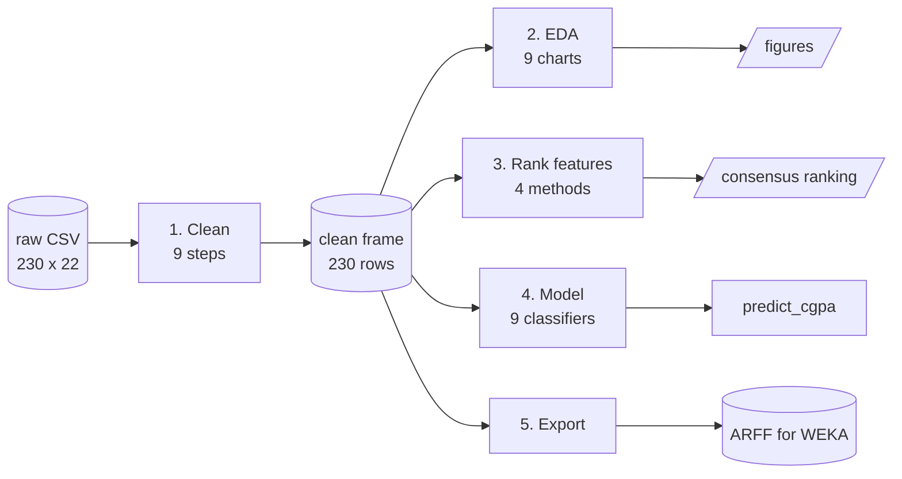
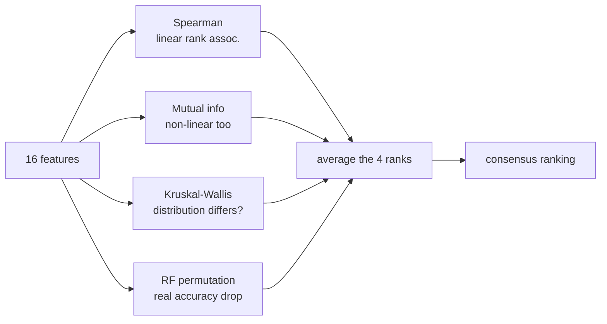

# Notebook walkthrough — plain English breakdown

A guide to `notebooks/01_cleaning_eda_modeling.ipynb` for teammates who will be viva'd on it.
Read this before the presentation. Every number here comes from an actual cell output.

## Table of contents

- [What this is](#what-this-is)
- [User verbs](#user-verbs)
- [Input → Output](#input--output)
- [Module map](#module-map)
- [Module 1 — Clean (recursed)](#module-1--clean-recursed)
- [Module 2 — EDA (atomic)](#module-2--eda-atomic)
- [Module 3 — Rank features (recursed)](#module-3--rank-features-recursed)
- [Module 4 — Model (atomic)](#module-4--model-atomic)
- [Module 5 — Export (atomic)](#module-5--export-atomic)
- [The three results you must be able to defend](#the-three-results-you-must-be-able-to-defend)
- [Your journey](#your-journey)
- [Viva cheat sheet](#viva-cheat-sheet)
- [Glossary](#glossary)

---

## What this is

One notebook that takes 230 raw Google Form responses and produces (a) two clean datasets WEKA
can open, (b) a ranked list of which features affect grades, and (c) a model that predicts a
student's CGPA band.

It is also the evidence file. Sir will ask *"data preprocessing kmne kora hoise?"* — the answer
is not "we cleaned it", it is a specific cell with a specific number in it.

## User verbs

- **Run it** — `Run All`. Takes about 3 minutes, regenerates every CSV, ARFF and figure.
- **Read a decision** — every cleaning step is a heading of the form *Decision → Why*.
- **Predict a student** — call `predict_cgpa({...})` in §9 with a student's form answers.
- **Feed WEKA** — take `cleaned-dataset/ours/behavior.arff` into the WEKA Explorer.

## Input → Output

```
IN   raw-data/University Student Performance Analysis Form (Responses).csv
     230 rows x 22 columns, bilingual headers, free-text university names,
     GPA collected as bands ("3.5+"), 44 blanks in one column

OUT  cleaned-dataset/ours/
       primary_clean.csv     230 x 24   with previous CGPA
       behavior_clean.csv    230 x 23   without previous CGPA
       primary.arff          230 instances, 22 attributes + class
       behavior.arff         230 instances, 21 attributes + class
     docs/figures/*.png      17 charts
     docs/results_summary.json
```

## Module map



> Caption: cleaning runs once; EDA, ranking, modelling and export all read the same cleaned frame,
> so no two sections can disagree about the data.

---

## Module 1 — Clean (recursed)

Black box: messy 22-column form → tidy 230-row table with a 4-class target and zero missing
values. **No rows are dropped.**

| Step | What it does | Why (the viva answer) |
|------|--------------|----------------------|
| 5.1 | Drop `timestamp` | It records *when* someone submitted, which follows how the link spread through our friend circles. A tree could split on "submitted after Aug 24" and learn our sampling order. |
| 5.2 | 9 university spellings → 3 | `BRAC`, `Brac`, `BRAc`, `BRAC University`, `BRAC UNI` are one institution. Unmerged, BRAC's 101 students split into 5 weak groups. |
| 5.3 | Merge 2 department columns → 1 | They are complementary: 174 + 56 = 230. Exactly 1 row answered both, 1 answered neither. Dropping either column deletes a real answer for a quarter of respondents. |
| 5.3b | Group departments with < 5 students into `Other` | A category with 2 members cannot be learned. A tree splitting on it is memorising two people. |
| 5.4 | 44 blanks → `none` | **The best example in the notebook.** See below. |
| 5.5 | 6 GPA bands → 4 classes | 6 classes over 230 students = ~26 each; a 10-fold CV then has 2–3 per class per fold, making per-class F1 noise. 4 classes come out balanced (60/52/63/55). |
| 5.6 | Likert text → ordinal integers | `Never < Rarely < Sometimes < Often` is an *order*. One-hot throws it away and turns 15 columns into ~70 on 230 rows. |
| 5.7 | Drop `result_satisfaction` | Leakage. See below. |
| 5.8 | Derive `academic_progress` + 4 indices | Raw semester number is really the university in disguise. See below. |

### 5.4 — the missing-data step, in full

Do **not** say "we dropped missing values" in the viva. We did the opposite, and here is why.

```
Options the form offered: 1-5 hrs | 6-10 hrs | 11-15 hrs | More than 15 hrs
                          ^^^ there is no zero option, and the question was optional

Blank rate by university:   BRAC 21.8%   BUET 15.4%   CUET 24.0%
Chi-square, blankness vs GPA band: chi2 = 5.38, dof = 5, p = 0.372
```

p = 0.372 means blankness has **no relationship with performance**. Combined with the missing
zero option, a blank almost certainly means *"I have no tuition/job/club load"* — a real answer.
So we imputed it as a new lowest category `none` instead of deleting 44 of our 230 rows (19%).

### 5.7 — the leakage step

The form asked *"How satisfied were you with your latest semester result?"* about the **same
semester** whose grade is our target.

```
Spearman(result_satisfaction, target) = 0.601   (p = 2e-24)
```

That is not a cause of the grade, it is a **restatement** of it. A model using it would score
well and teach us nothing — "students happy with their grades have good grades." We excluded it
from every model, but kept it as a data-quality check: satisfaction rising cleanly from C0 to C3
is evidence that people answered the GPA question honestly.

### 5.8 — the confound step

```
semester by university:
          1  2  3  4  5  6  7  8  9  10 11 12
  BRAC    0  0  0  0  0  0  0  0  0  48 53  0
  BUET   10  3  8  8 14  8 17  6  6   7  8  9
  CUET    0  0  0  0  0  0 25  0  0   0  0  0
```

**BRAC runs trimesters**, so every BRAC student reports semester 10 or 11. All 25 CUET
respondents are in semester 7. "Semester 11" does not mean *further along* — it means *BRAC*.
Feeding the raw number to a model lets it recover the university and learn per-university
grading habits while looking like it learned about academic progress. Fixed by dividing by each
university's programme length to get a comparable 0–1 `academic_progress`.

### 5.8b — the four indices FAILED, and that is in the notebook

We hypothesised that items like attendance + study hours + study style all measure one trait,
"discipline", and built four composite indices. Then we tested them:

```
discipline_index    alpha = 0.022
wellbeing_index     alpha = 0.048
environment_index   alpha = 0.053
motivation_index    alpha = 0.038      (alpha >= 0.7 is "good")
```

Alpha near zero means the items are **mutually uncorrelated** — a student with high attendance
is no more likely than chance to also study long hours. There is no latent "discipline" trait
here. We kept the columns in the export but **model the raw items instead**, and no conclusion
rests on an index. If asked: *we formed a hypothesis, tested it, and the data rejected it.*

## Module 2 — EDA (atomic)

Nine charts, each answering one question. It does one obvious thing: look, then conclude.

| Chart | Question | Answer we got |
|-------|----------|---------------|
| `01_missingness` | What is missing? | Only 3 columns; two are mirror images of each other |
| `04_target_distribution` | Is it balanced? | Yes, 23–27% per class → **accuracy is fair, ZeroR = 27.4%** |
| `05_feature_distributions` | Any dead columns? | No, every scale is used |
| `06_skewness` | Any degenerate scale? | No, all \|skew\| < 1 → nothing dropped, no transform needed |
| `07_feature_vs_target_boxplots` | Which features shift across bands? | Almost none — first hint of the null result |
| `08_university_confound` | Do universities grade differently? | Yes, significantly |
| `09_correlation_heatmap` | Any redundant features? | No independent pair exceeds \|rho\| = 0.5 → nothing dropped |

**Why no log/Box-Cox transform:** those are for continuous variables. On a 5-point ordinal code
they produce meaningless fractional categories, and the tree models we use are invariant to
monotonic transforms anyway.

## Module 3 — Rank features (recursed)

Black box: 16 behavioural features → a ranked list of what matters.

We use **four independent methods** because no single one is trustworthy on 230 rows.



> Caption: a feature only reaches our headline list if several different kinds of evidence agree.

Two details worth defending:

- **Permutation importance, not Gini importance.** A tree's built-in Gini importance is measured
  on training data and is biased toward features with many distinct values. Permutation
  importance measures the actual out-of-fold accuracy drop when you shuffle a feature.
- **FDR correction.** Testing 16 features at p < 0.05 produces ~1 false positive by chance. We
  apply Benjamini–Hochberg so we do not report noise as a finding.

**Result: zero features survive correction.** `topic_clarity` is the only one significant even
uncorrected (rho = −0.161, p = 0.014, q = 0.214). See the results section below.

## Module 4 — Model (atomic)

Nine classifiers, 10-fold stratified CV repeated 3×, scored on accuracy / macro-F1 / weighted-F1
/ kappa / within-1-band. Same protocol as the WEKA tutorial so the numbers are comparable.

**Why repeated CV and not a train/test split:** n = 230. A 20% test set is 46 rows — far too
noisy to rank nine models against each other.

## Module 5 — Export (atomic)

Writes CSV and ARFF. ARFF is preferred because it pins each attribute's type and the exact
nominal value set, so WEKA cannot silently read an ordinal code as something else or guess the
class order. The class attribute is written last, as WEKA expects.

---

## The three results you must be able to defend

### 1. Behaviour alone barely predicts grades

| Model | Accuracy | Macro-F1 | Kappa |
|-------|----------|----------|-------|
| **ZeroR (baseline)** | 27.4% | 0.108 | 0.000 |
| Gradient Boosting | 34.5% | 0.320 | 0.093 |
| Random Forest | 34.9% | 0.306 | 0.104 |
| Logistic Regression | 32.2% | 0.293 | 0.078 |

Kappa ≈ 0.09 means *almost no agreement beyond chance*. Say this plainly. The teacher's tutorial
explicitly says **"A weak behaviour-model result is still a valid finding"** and **"report weak
or negative findings honestly."**

### 2. Previous CGPA is what actually carries the signal

| | Accuracy | Macro-F1 | Kappa | Within 1 band |
|---|---|---|---|---|
| Primary (with previous CGPA) | **51.0%** | 0.499 | 0.351 | 81.3% |
| Behaviour-focused | 34.5% | 0.320 | 0.093 | 67.4% |

Adding one variable — the student's previous CGPA — is worth **+16.5 accuracy points**. Past
performance predicts future performance; self-reported habits mostly do not.

> **Trap:** ZeroR scores 0.739 on `within_1_band`, higher than any behaviour model. That is a
> metric artefact — ZeroR always predicts the middle class C2, which is within one band of C1,
> C2 and C3, so it collects a free 74%. Always read `within_1_band` next to **kappa**.

### 3. Two counterintuitive effects that are real

We checked these against the raw form text and stratified by university, so they are not
encoding bugs:

- **Clearer lectures → slightly lower grades** (rho = −0.161). Concentrated at BUET (rho = −0.27,
  p = 0.006), flat at BRAC, slightly positive at CUET. Most plausible reading is a
  **self-assessment calibration effect**: weaker students overestimate how much they understood,
  because they do not know what they missed.
- **More stress → slightly higher grades** (mean stress rises 2.07 → 2.53 from C0 to C3). Likely
  reverse causation: students holding a high CGPA have more to lose.

Neither survives FDR correction. Present both as **observations with a plausible mechanism**,
never as causes.

---

## Your journey

When YOU open the notebook and hit Run All:

1. **§2** loads 230 rows and renames 22 bilingual questions to short names.
2. **§3** audits it — finds 3 columns with blanks, 0 duplicates, 9 spellings of 3 universities.
3. **§4** compares the pre-existing `cleaned-dataset/` files against the raw form and prints the
   mismatch (878 rows vs 230, KUET departments). This is why we rebuilt them.
4. **§5** runs 9 cleaning steps, prints a step log, asserts 230 rows / 0 missing / no leakage
   column, then writes `primary_clean.csv` and `behavior_clean.csv`.
5. **§6** draws 9 EDA charts into `docs/figures/`.
6. **§7** runs 4 importance methods and prints "NO feature survives multiple-comparison
   correction", then §7.8 verifies the two odd signs are real.
7. **§8** cross-validates 9 classifiers twice (with and without previous CGPA), draws confusion
   matrices, the learning curve, and a readable depth-3 tree.
8. **§9** predicts three example students. **Expect flat probability distributions** — the model
   prints a `[!] LOW CONFIDENCE` warning when it cannot tell, which is the honest behaviour given
   §7.
9. **§10** writes the ARFF files. **WEKA will show 230 instances**, not the 878 the supplied
   tutorial PDF mentions.
10. **§11** prints the summary and writes `docs/results_summary.json`.

## Viva cheat sheet

| Question | Your answer |
|----------|-------------|
| *Data preprocessing kmne kora hoise?* | 9 steps, §5. Zero rows dropped. 44 values imputed as `none` after a chi-square test showed blankness was unrelated to GPA (p = 0.372). |
| *Missing value kmne handle korso?* | Not by dropping. The form had no zero option, so blank = "none". We tested that assumption before acting on it. |
| *Keno accuracy kom?* | Because the honest signal is weak. Behaviour-only kappa = 0.09. The learning curve is flat, so more of the *same* data would not help — the ceiling is the features, not the sample size. |
| *Ki korle accuracy barto?* | (a) Objective grades from the registrar instead of self-reports. (b) Previous CGPA — already worth +16.5 points. (c) Course-level rather than semester-level data. Not: more rows of the same survey. |
| *Keno ei evaluation metrics?* | Classes are balanced so accuracy is fair; macro-F1 because every band matters equally; kappa because it corrects for chance; within-1-band because the target is *ordinal* — predicting C2 when the truth is C3 is a smaller error than predicting C0. |
| *One-hot keno koro nai?* | The Likert scales are **ordered**. One-hot destroys the order and turns 15 columns into ~70 on 230 rows. Only `university` and `department` are genuinely nominal, and those we do one-hot. |
| *Cleaned dataset ta use korso na keno?* | It has 878 rows where our form collected 230, contains departments no respondent named, and has a `kuet_satisfaction` column. It is a different dataset. We kept its schema and rebuilt the rows. |

## Glossary

- **SGPA** — Semester GPA, the grade for one semester. Our target came from this field.
- **CGPA** — Cumulative GPA across all semesters so far. Used as the "previous performance" feature.
- **Ordinal** — categories with a real order (Never < Rarely < Sometimes), unlike nominal ones (CSE, EEE).
- **ZeroR** — the do-nothing baseline that always predicts the most common class. Any real model must beat it.
- **Kappa** — Cohen's kappa; agreement corrected for what you would get by guessing. 0 = chance-level, 1 = perfect.
- **Macro-F1** — F1 averaged equally over the 4 classes, so a rare class counts as much as a common one.
- **FDR** — False Discovery Rate; the correction applied because testing 16 features at once produces false positives by chance.
- **Cronbach's alpha** — whether items in a composite index actually measure one common thing. Ours came out ≈ 0, so they do not.
- **Leakage** — a feature that secretly contains the answer, making a model look good for no real reason.
- **ARFF** — WEKA's native file format; like CSV but it declares each attribute's type.
